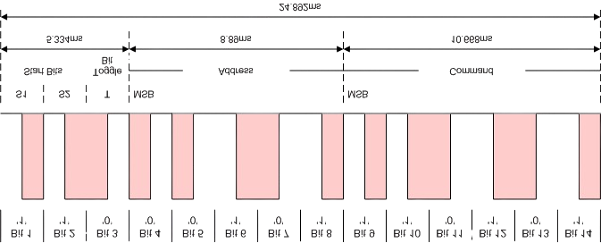

# RC5 receiver
## Introduction

This ESP-IDF component is designed for receiving RC5 infrared remote control signals. It includes an algorithm for handling auto-repeat functionality, which can be enabled or disabled based on the application's requirements.

### Features
- Initialization and configuration of the RC5 receiver
- Decoding of RC5 signals
- Handling of received commands
- Auto-repeat function

### Usage
1. Initialize the RC5 receiver by calling the appropriate initialization function and passing a pointer to a callback function.
2. The callback function will be called when a valid RC5 packet is received.
3. Process the decoded commands within the callback function as needed in your application.

### Example
```c
// Callback function to process received RC5 commands
void rc5_handler(rc5_data_t rc5_data)
{
    // Process the command (send messages, generate events etc)
    process_rc5_command(rc5_data);
}

void app_main(void)
{
    // Initialize the RC5 receiver with the callback function
    rc5_receiver_init(rc5_handler);

    // Main loop
    while (true) {
        // Application code
    }
}
```

### Auto-Repeat Algorithm

When the auto-repeat algorithm is enabled, the component forwards every n-th received RC5 packet to the `rc5_handler` callback function. The value of `n` is determined by the `rc5_auto_repeat_postscaler` parameter. This allows the application to handle repeated commands at a controlled rate, preventing excessive processing of repeated signals.

If the auto-repeat algorithm is disabled, only a single command is sent to the `rc5_handler` callback function when a key is pressed. No additional commands are sent until the current key is released and a new key is pressed.

## Public interface

### RC5 command format

The format is given in following pictures


Normal format, `'1'` are presented as `0 -> 1` transitions and `'0'` are presented as `1 -> 0` transitions.



Inverted format, `'1'` are presented as `1 -> 0` transitions and `'0'` are presented as `0 -> 1` transitions.

The RC5 command frame is presented by following type. It follows definitions in above pictures.

```c
typedef union {
    struct {
        uint16_t command:6;
        uint16_t address:5;
        uint16_t toggle:1;
        uint16_t start:2;
        uint16_t reserved:2;
    };
    uint16_t frame;
} rc5_data_t;   // RC5 command data structure
```

The following functions are available in the RC5 receiver component:

### `void set_auto_repeat(bool enabled, int threshold)`

Enable or disable auto-repeat functionality.

- **Description**: This function sets the auto-repeat feature for the component. When enabled, the component will automatically repeat actions after a specified threshold.
- **Parameters**:
    - `enabled`: A boolean value to enable (`true`) or disable (`false`) auto-repeat.
    - `threshold`: An integer value specifying the threshold for auto-repeat.

### `esp_err_t rc5_receiver_init(rc5_handler_t rc5_handler)`

Initialize the RC5 receiver.

- **Description**: This function initializes the RC5 receiver with the provided handler. It sets up the necessary configurations and prepares the receiver for operation.
- **Parameters**:
    - `rc5_handler`: A handler function of type `rc5_handler_t` to process received RC5 signals.
- **Returns**: `ESP_OK` on successful initialization, or an error code on failure.

### `void rc5_terminate(void)`

Terminate the RC5 receiver.

- **Description**: This function terminates the RC5 receiver, releasing any resources that were allocated during initialization. It should be called when the receiver is no longer needed.

### Callback Function

The prototype of the callback function is as follows:

```c
void rc5_handler(rc5_data_t rc5_data);
```

## Implementation details.

The RC5 receiver component is implemented in the `rc5_receiver.c` file. Below are the key implementation details:

### Initialization

The `rc5_receiver_init` function initializes the RC5 receiver by configuring the necessary hardware peripherals and setting up the interrupt service routine (ISR) to handle incoming RC5 signals. It also registers the provided callback function to process the decoded RC5 commands.

### Signal receiving

The input signals (rmt symbols) are received in `rmt_symbol_word_t rc5_buffer[RC5_BUFFER_SIZE]`. After a RC5 packet si received, `rmt_rx_done_callback` is called. It copies received symbols from `rmt_symbol_word_t rc5_buffer[RC5_BUFFER_SIZE]`to `rmt_symbol_word_t rc5_buffer_cp[RC5_BUFFER_SIZE]`. Then it notifies the `rc5_receive_task` thread, which performs the actual decoding by calling the `rc5_decoder` function. Once decoding is complete, the decoded command is passed to the registered callback function. After this notification, `rmt_rx_done_callback` calls ` rmt_receive` so as to initiate new receiver session.

### Auto-Repeat Handling

The auto-repeat functionality is managed by a postscaler counter within the `rc5_receive_task` thread. When auto-repeat is enabled, the counter increments with each received RC5 packet. Once the counter reaches the specified threshold, the decoded command is forwarded to the callback function, and the counter is reset. This ensures that repeated commands are processed at a controlled rate.

### Termination

The `rc5_terminate` function stops the RC5 receiver by disabling the hardware peripherals and unregistering the ISR. It also releases any resources that were allocated during initialization.

### Error Handling

The component includes error handling mechanisms to ensure robust operation. If an error occurs during initialization or signal decoding, appropriate error codes are returned, and the component attempts to recover or notify the application of the failure.

These implementation details ensure that the RC5 receiver component operates efficiently and reliably, providing accurate decoding of RC5 remote control signals and flexible handling of auto-repeat functionality.

### Configuration Settings

The RC5 receiver component can be configured using the following options in the `Kconfig` file:

#### `CONFIG_RC5_RX_GPIO`
- **Description**: GPIO pin used for RC5 receiver input.
- **Type**: Integer
- **Default**: `4`
- **Range**: `0` to `39`

#### `CONFIG_RC5_INVERT_IN`
- **Description**: Invert the RC5 input signal.
- **Type**: Boolean
- **Default**: `y` (enabled)

#### `CONFIG_RMT_CLK_RES_HZ`
- **Description**: Clock resolution for the RMT peripheral.
- **Type**: Integer
- **Default**: `1000000` (1 MHz)

#### `CONFIG_RC5_BUFFER_SIZE`
- **Description**: Number of symbols in the RC5 receive buffer.
- **Type**: Integer
- **Default**: `64`
- **Range**: `20` to `64`

#### `CONFIG_RC5_SYMBOL_DURATION_US`
- **Description**: Duration of a single RC5 symbol in microseconds.
- **Type**: Integer
- **Default**: `899`

#### `CONFIG_RC5_TOLERANCE_US`
- **Description**: Tolerance for signal duration in microseconds.
- **Type**: Integer
- **Default**: `200`

#### `CONFIG_RC5_AUTO_REPEAT_ENABLE`
- **Description**: Enable handling of auto-repeat RC5 commands.
- **Type**: Boolean
- **Default**: `y` (enabled)

#### `CONFIG_RC5_AUTO_REPEAT_POSTSCALER`
- **Description**: Postscaler value to determine how often auto-repeat commands are processed.
- **Type**: Integer
- **Default**: `5`
- **Range**: `1` to `255`

These configuration options allow you to customize the behavior of the RC5 receiver component to suit your application's requirements. You can adjust the GPIO pin, invert the input signal, set the clock resolution, buffer size, symbol duration, tolerance, and configure the auto-repeat functionality as needed.
