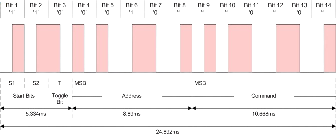
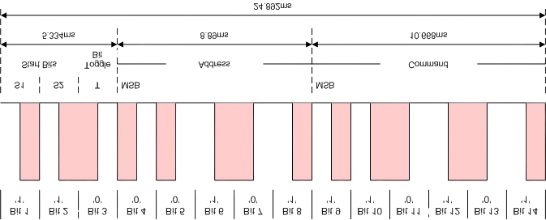

# RC5 receiver
## Introduction

This ESP-IDF component is designed for receiving RC5 infrared remote control signals. It includes an algorithm for handling auto-repeat functionality, which can be enabled or disabled based on the application's requirements.

### Features
- Initialization and configuration of the RC5 receiver
- Decoding of RC5 signals
- Handling of received commands
- Support for shot press (single click) and Long pressed (press and hold)

### Usage
1. Initialize the RC5 receiver by calling the appropriate initialization function and passing a pointer to a callback function.
2. The callback function will be called when a valid RC5 packet is received.
3. Process the decoded commands within the callback function as needed in your application.

### Example
```c
static QueueHandle_t rc5_queue = NULL;
// A thread that waits RC5 commands via queue and process them
void rc5_handler(rc5_event_t event, rc5_data_t rc5_data)
{
    rc5_context_t rc5;
    ESP_LOGI(TAG, "RC5 handler started");
    QueueHandle_t q = (QueueHandle_t)param;
    while (true) {
        if (xQueueReceive(q, &rc5, portMAX_DELAY) == pdTRUE) {
            // processing command
            ESP_LOGI(TAG, "RC5 frame: 0x%04X, command: 0x%02X, address: 0x%02X, toggle: %d, start: %d, event: %s",
                rc5.rc5_data.frame, rc5.rc5_data.command, rc5.rc5_data.address, rc5.rc5_data.toggle, rc5.rc5_data.start,rc5_event_name(rc5.event));
            // exit if a termination message is received
            if (rc5.event == RC5_EVENT_INVAID) {
                break;
            }
        }
    }
    ESP_LOGI(TAG, "RC5 handler terminated");
    vTaskDelete(NULL);
}
static QueueHandle_t rc5_queue = NULL;
void app_main(void)
{
    // Initialize the RC5 receiver with the callback function
    rc5_queue = xQueueCreate(10, sizeof(rc5_context_t));
    rc5_receiver_init(rc5_queue);

    // Main loop
    while (true) {
        // Application code
    }
}
```

### Short and Long Press Functionality

The RC5 receiver component supports both short press (single click) and long press (press and hold) functionalities, allowing the application to differentiate between brief and extended key presses on the remote control.

#### Short Press

A short press is detected when a key is pressed and released within a short duration. The `rc5_handler` callback function is called once with the decoded command when the key is pressed. This is typically used for actions that require a single activation, such as toggling a light or starting a playback.

#### Long Press

A long press is detected when a key is held down for a longer duration. The component continuously monitors the duration of the key press and, upon detecting a long press, calls the `rc5_handler` callback function with the decoded command. This allows the application to perform actions that require sustained activation, such as adjusting volume or scrolling through a menu.

The long press functionality ensures that repeated commands are processed at a controlled rate, preventing excessive processing of repeated signals. This is useful for applications that need to perform different actions based on the duration of the key press, such as adjusting volume continuously while a key is held down or executing a different command for a long press.

To distinguish short and long presses an additional argument is given to the callback fucntion: `rc5_event_t event` It determines what happened with the key - `RC5_EVENT_SHORT_PRESS`, `RC5_EVENT_LONG_PRESS_START` or `RC5_EVENT_LONG_PRESS_END`. Having this information the application can implement its logic.

## Public interface

### RC5 command format

The format is given in following pictures



Normal format, `'1'` are presented as `0 -> 1` transitions and `'0'` are presented as `1 -> 0` transitions.



Inverted format, `'1'` are presented as `1 -> 0` transitions and `'0'` are presented as `0 -> 1` transitions.

The RC5 command frame is presented by following type. It follows definitions in above pictures.

```c
typedef union {
    struct {
        uint16_t command:6;
        uint16_t address:5;
        uint16_t toggle:1;
        uint16_t start:2;
        uint16_t reserved:2;
    };
    uint16_t frame;
} rc5_data_t;   // RC5 command data structure
```

### Short and long press definitions

Following `enum` defines the event types that RC5 Receiver can generate.
```c
// Events
typedef enum {
    RC5_EVENT_SHORT_PRESS,           // the key was short ressed
    RC5_EVENT_LONG_PRESS_START,      // long press has began
    RC5_EVENT_LONG_PRESS_END,        // long press has ended
    RC5_EVENT_INVAID = 255
} rc5_event_t;
```

### rc5_context_t

The received commands re packed in a C struct of a type `rc5_context_t`:

```ctypedef struct {
    rc5_event_t event;        // Event type (Short press, long press start, long press end)
    rc5_data_t rc5_data;      // RC5 command data
} rc5_context_t;
```

Received of this data type is sent to supplied by the application rc5_received handler. A queue of this type is used to do this.

The following functions are available in the RC5 receiver component:

### `esp_err_t rc5_receiver_init(QueueHandle_t queue)`

Initialize the RC5 receiver.

- **Description**: This function initializes the RC5 receiver with the provided handler. It sets up the necessary configurations and prepares the receiver for operation.
- **Parameters**:
    - `queue`: A handle to a queue, where RC5 component will put received RC5 commands.
- **Returns**: `ESP_OK` on successful initialization, or an error code on failure.

### `void rc5_terminate(void)`

Terminate the RC5 receiver.

- **Description**: This function terminates the RC5 receiver, releasing any resources that were allocated during initialization. It should be called when the receiver is no longer needed.

### Callback thread

The prototype of the callback thread is as follows:

```c
void rc5_handler(QueueHandle_t queue);
```

## Implementation details.

The RC5 receiver component is implemented in the `rc5_receiver.c` file. Below are the key implementation details:

### Initialization

The `rc5_receiver_init` function initializes the RC5 receiver by configuring the necessary hardware peripherals and setting up the interrupt service routine (ISR) to handle incoming RC5 signals. It also registers the provided callback function to process the decoded RC5 commands.

### Signal receiving

The input signals (rmt symbols) are received in `rmt_symbol_word_t rc5_buffer[RC5_BUFFER_SIZE]`. After a RC5 packet si received, `rmt_rx_done_callback` is called. It copies received symbols from `rmt_symbol_word_t rc5_buffer[RC5_BUFFER_SIZE]`to `rmt_symbol_word_t rc5_buffer_cp[RC5_BUFFER_SIZE]`. Then it notifies the `rc5_receive_task` thread, which performs the actual decoding by calling the `rc5_decoder` function. Once decoding is complete, the decoded command is passed to the registered callback function. After this notification, `rmt_rx_done_callback` calls ` rmt_receive` so as to initiate new receiver session.

### Termination

The `rc5_terminate` function stops the RC5 receiver by disabling the hardware peripherals and unregistering the ISR. It also releases any resources that were allocated during initialization.

### Error Handling

The component includes error handling mechanisms to ensure robust operation. If an error occurs during initialization or signal decoding, appropriate error codes are returned, and the component attempts to recover or notify the application of the failure.

These implementation details ensure that the RC5 receiver component operates efficiently and reliably, providing accurate decoding of RC5 remote control signals and flexible handling of auto-repeat functionality.

### Configuration Settings

The RC5 receiver component can be configured using the following options in the `Kconfig` file:

#### `CONFIG_RC5_RX_GPIO`
- **Description**: GPIO pin used for RC5 receiver input.
- **Type**: Integer
- **Default**: `4`
- **Range**: `0` to `39`

#### `CONFIG_RC5_INVERT_IN`
- **Description**: Invert the RC5 input signal.
- **Type**: Boolean
- **Default**: `y` (enabled)

#### `CONFIG_RMT_CLK_RES_HZ`
- **Description**: Clock resolution for the RMT peripheral.
- **Type**: Integer
- **Default**: `1000000` (1 MHz)

#### `CONFIG_RC5_BUFFER_SIZE`
- **Description**: Number of symbols in the RC5 receive buffer.
- **Type**: Integer
- **Default**: `64`
- **Range**: `20` to `64`

#### `CONFIG_RC5_SYMBOL_DURATION_US`
- **Description**: Duration of a single RC5 symbol in microseconds.
- **Type**: Integer
- **Default**: `899`

#### `CONFIG_RC5_TOLERANCE_US`
- **Description**: Tolerance for signal duration in microseconds.
- **Type**: Integer
- **Default**: `200`

#### `CONFIG_RC5_LONG_PRESS_THRESHOLD`
- **Description**: Threshold value to determine how long a button must be pressed to be considered a long press. This is the number of RC5 frames that must be received before a long press is detected.
- **Type**: Integer
- **Default**: `200`

#### `CONFIG_RC5_FRAME_INTERVAL`
- **Description**: Interval in milliseconds RC5 frames come.
- **Type**: Integer
- **Default**: `107`

These configuration options allow you to customize the behavior of the RC5 receiver component to suit your application's requirements. You can adjust the GPIO pin, invert the input signal, set the clock resolution, buffer size, symbol duration, tolerance, and configure the auto-repeat functionality as needed.
